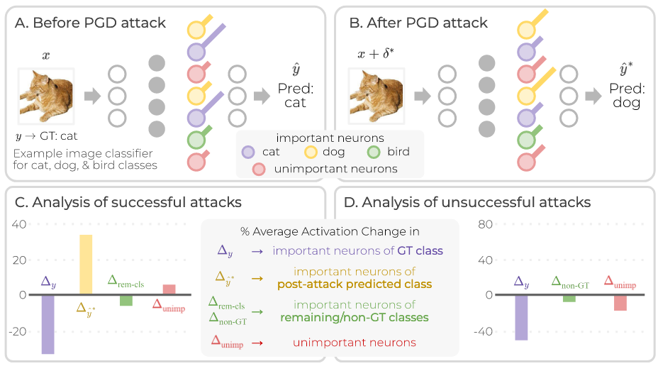
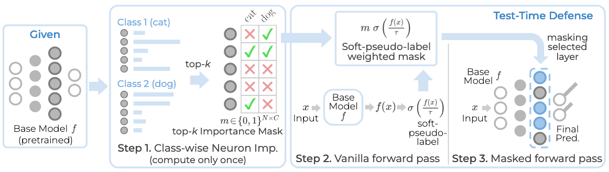
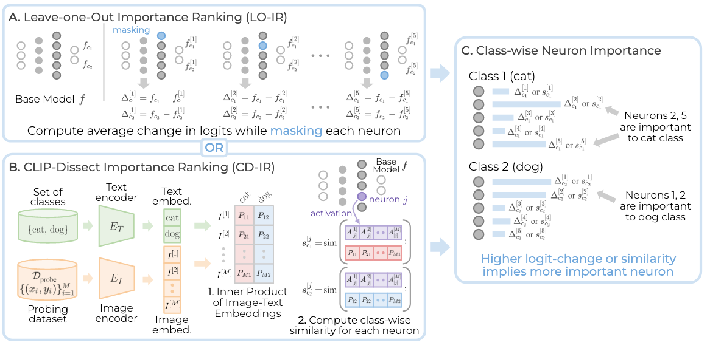
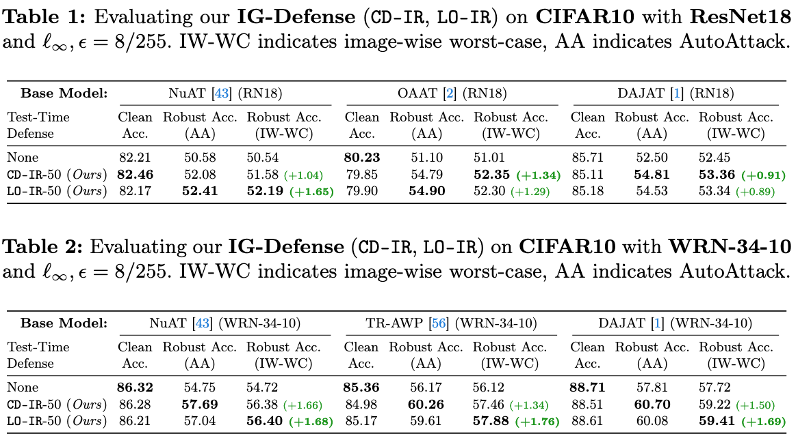
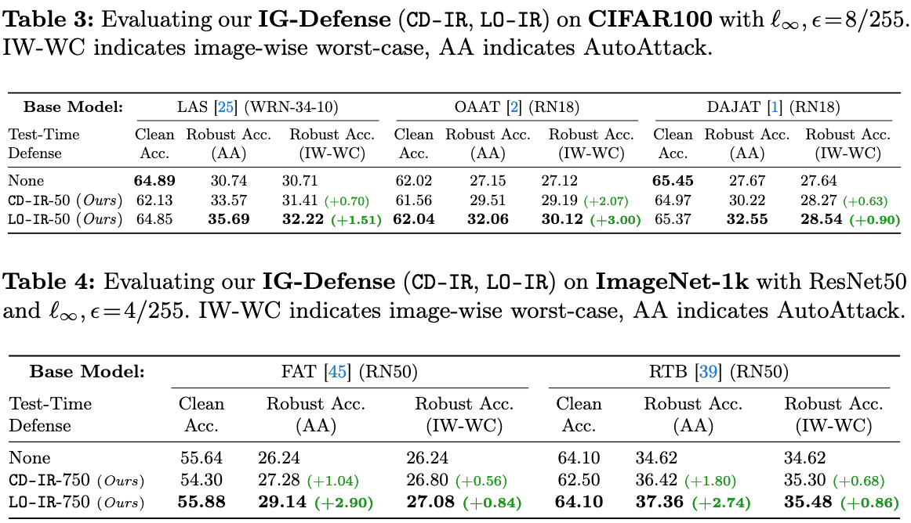
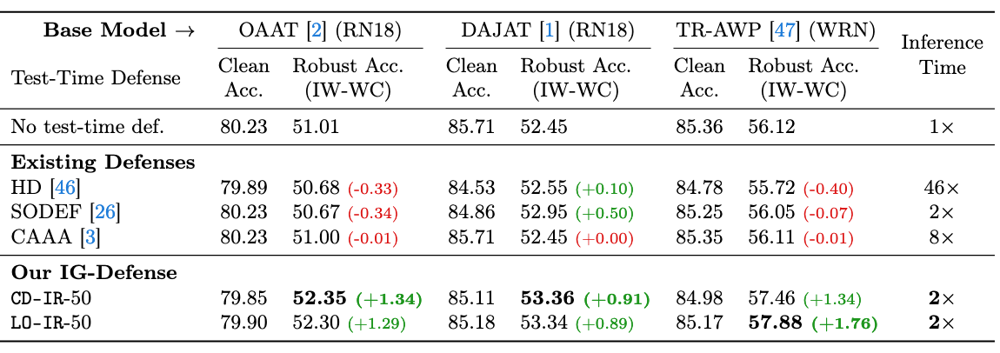

# Interpretability-Guided Test-Time Adversarial  Defense

**会议/期刊：** ECCV 2024

**作者：**Akshay Kulkarni、Tsui-Wei Weng

**代码仓库：**https://github.com/Trustworthy-ML-Lab/Interpretability-Guided-Defense

---

## 研究背景与动机

一次对抗训练成本远高于一次标准训练的成本，因此有工作设计了不需要训练的防御，即测试阶段防御（test-time defenses）。现有的测试阶段防御方法主要分为两个分支，分别是输入净化（input purification）和模型适应（model adaptation）。现有方法仍有以下局限：

- **时间开销**仍然很大。即使不需要训练，但是跟一次标准前向传播比起来，耗时仍然很多。
- 在很强的**自适应攻击（adaptive attacks）**下，防御会失效。自适应攻击是攻击者专门针对防御方法设计的攻击，而不是通用攻击，具有很强的攻击性。
- 防御方法常常会损害在干净样本上的分类正确率。这个局限不是本论文的研究重点，不过确实存在。

作者发现：（重新理解“攻击”）

- 攻击会误导模型分类到错误的类别，即将降低真正重要的神经元激活程度，增加错误类别的重要神经元激活程度。
- 攻击失败后，所有神经元的几乎程度都会降低。因为就算降低后，决策的方向没有改变，所以没有出现分类错误的现象。

针对前两点局限和对攻击的理解，作者**首次**提出了IG-Defense（test-time interpretability-Guided Defense）。IG-Defense的速度非常快（2X 常规推理时间），同时在自适应攻击下，能有更高的正确率。

---

## 核心思想与方法框架

### 核心思路

1. 获取每个类别的top-k重要神经元，并得到掩码。重要神经元对应的掩码为1，其余为0。
2. 前向传播获取软伪标签（soft-pseudo label）。soft是指可以通过超参数$\tau$放大logit之间的差异，因此本文中的$\tau$取得比较小。除此之外，这个流程就是一次普通的前向传播并经过softmax后，得到每个类别的概率值。将软伪标签与前一步的掩码相乘得到加权掩码。
3. 对部分网络层进行掩码后再次前向传播。本文实验发现选择靠后的网络层进行掩码效果更好，因此最终采用的是对倒数第二层进行掩码。

### 细节解释

1. 重要性排序。每一个模型仅需要使用干净的数据计算一次，相当于建立了一个重要性字典。

- LO-IR：依次掩码每个神经元，计算掩码前后的logits变化。变化越大，越重要。
  - 效果更好
  - 开销更大
- CD- IR：利用CLIP，获得文本嵌入和图像嵌入。将两者进行内积后，获得更优的语义参考。与每个神经元经过激活层之后的logits计算相似度，越相似，越重要。

2. 整个流程高度依赖软伪标签。如果这个伪标签预测错误，那么就会很大程度的影响加权码掩。

作者似乎也发现这个问题了，所以在伪标签这里添加了Randomized Smoothing。简而言之是一个均值为0，方差为1的高斯噪声，然后没有做出过多解释为什么能缓解伪标签预测错误的情况下的问题。**（牵强）**

---

## 实验结果

> 最大范数$L_{\infty}$表示每个像素点能添加的噪声最大值。添加的噪声越大，越能迷惑模型。

通过主实验，可以发现IG-Defense确实有一定提升，同时推理时间很快。不过，有一个防御方法常会出现的问题，即防御会降低在干净数据上的正确率。

---

## 不足与潜在改进方向

- 对软伪标签错误情况下的解释不够清晰
- *Adversarial Examples Are Not Bugs, They Are Features* 指出对抗样本本身也是一种特征。它们能具有分类能力，但是很脆弱。因此，本文是否应该适当考虑不重要的神经元，而不是彻底忽略呢？

---

## 启发

- 能否将本文的获取重要神经元的思路（LO-IR和CD-IR）应用到域泛化上呢？
- 选择出重要神经元的过程仍然比较耗时，此外考虑到不重要的神经元也许也具有分类能力，那么能否不选择出重要神经元，而是借鉴域泛化的思路，让模型多去利用更多的神经元，而不是仅利用几个重要的神经元。类似于获取域不变特征。
- 如何理解“攻击”？能否将被攻击后的样本认为是一张全新的图像但是具有不同的分布呢？如果可以，可以将对抗攻击转化为模型泛化，能模型能够分类被攻击的样本。