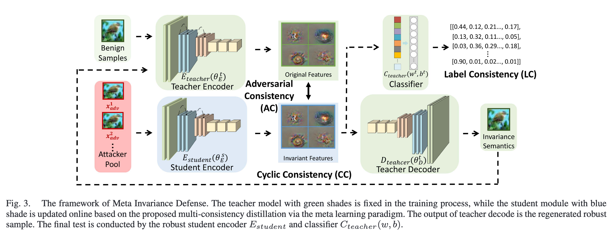

# Meta Invariance Defense Towards Generalizable  Robustness to Unknown Adversarial Attacks

**会议/期刊：** IEEE TPAMI 2024

**作者：** Lei Zhang Yuhang Zhou, Yi Yang, Xinbo Gao

---

## 研究背景与动机

目前的防御主要集中在已知的攻击，但是忽略了对未知攻击的鲁棒性——不能防住没见过的攻击，无法举一反三。并且，在现实部署中，常用的适应性学习以及微调技巧都是不适用的，因为对抗防御本质上是零样本问题。现实中，无法知道攻击者会采用哪种攻击，更无法保证这种攻击被模型在训练中适应过。

因此，本文提出了robustness to unknown adversarial attacks。核心方法简称为MID

---

## 核心思想与方法框架

在有限已知攻击下，元学习 + 模型蒸馏  $\rightarrow$  学习攻击不变特征（attack-invariant feature），从而拓展对未知攻击的鲁棒性。

为什么攻击不变特征能抵御攻击？（与域不变特征本质相同）

因为攻击是**局部性、针对性、最优的优化方向、受模型梯度结构限制**，即攻击存在共性，其难以改变结构稳定性强、可分类性强、非局部的语义特征，所以成功捕获到攻击不变性特征，就能提升模型对不同攻击的防御效果。

### 核心思路

1. 元学习流程，实际借用的是MAML的思想（Model-Agnostic Meta Learning）

   1. 元训练阶段：在*Attacker Pool*中随机采样攻击样本（参与了训练，即认为是已知攻击样本），原始模型一次梯度更新后，作为临时模型。用于模拟模型被攻击时的反应。
   2. 元测试阶段：在*Attacker Pool*中随机采样未被选中的攻击样本（模拟未知攻击样本），临时模型进行一次梯度更新。用于模拟
   3. $L_{total} = L_{meta-train} + L_{meta-test}$ 用于更新原始模型，提高原始模型在新任务中的适应能力。

   

2. Multi-consistency distilled from the teacher model——三个板块的损失函数设计

   > Teacher model是预训练好的。在下面流程中，模型参数被固定，不参与训练。实际训练的Student model。
   >
   > $E(\theta)$是特征提取器（encoder），$C(w,b)$是分类器，$F(\theta,w,b)$ 是一个完整的模型

   

   1. Adversarial Consistency 
      - $L_{\text{AC}} = \sum_{n=1}^{N} \sum_{i=1}^{I} 
        p\big(E_{\text{teacher}}(x_i, \theta_t)\big)
        \log \frac{p\big(E_{\text{teacher}}(x_i, \theta_t)\big)}
        {p\big(E_{\text{student}}(\tilde{x}_{i}^{n}, \theta_s)\big)}$
      - 含义：面对攻击样本，Student encoder的输出向Teacher encoder的输出对齐
      - 采用的是KL散度衡量两个分布之间的差异
   2. Cyclic Consistency
      - $L_{\text{CC}} = \sum_{n=1}^{N} \sum_{i=1}^{I} 
        p\big(E_{\text{teacher}}(x_i, \theta_t)\big)
        \log \frac{p\big(E_{\text{teacher}}(x_i, \theta_t)\big)}
        {p\big(E_{\text{teacher}}(\tilde{x}_{{reg}_{i}^{n}}, \theta_s)\big)}$
      - 含义：根据Student encoder输出的特征重新通过Teacher Decoder解码。重新生成的图像需要向Teacher encoder的输出对齐
      - 作者认为重新生产的图像在表征上具有足够好的鲁棒性，而不是在像素上，更干净。至于重新生成的图像应该替换原始图像，还是与原始图像结合后，再次进行Teacher encoder编码，作者没有进行详细说明。
   3. Label Consistency
      - $L_{\text{LC}} = - \sum^N_{n=1} \sum^I_i y_n \cdot \log \big(C(E_{\text{student}}(\tilde{x}_{i}^{n}, \theta_s),w,b) \big)$
      - 交叉熵分类损失。用于学习真实样本与输出之间的分布相似性。
   4. $L_{\text{meta\_train}}= \omega_{\text{AC}} \cdot L_{\text{AC}}(E_{\text{student}}, X^n) + \omega_{\text{CC}} \cdot L_{\text{CC}}(E_{\text{student}}, X^n) + \omega_{\text{LC}} \cdot L_{\text{LC}}(E_{\text{student}}, X^n)$
   5. $L_{\text{meta\_test}}= \omega_{\text{AC}} \cdot L_{\text{AC}}(E'_{\text{student}}, X_n') + \omega_{\text{CC}} \cdot L_{\text{CC}}(E'_{\text{student}}, X_n') + \omega_{\text{LC}} \cdot L_{\text{LC}}(E'_{\text{student}}, X_n')$
      - $E'_\text{student}$ 表示在训练中通过一次梯度更新的到的临时模型
      - $X'_n$表示未在训练过程出现过的攻击样本。用于模拟未知攻击
   6. $L_{total} = L_{meta-train} + L_{meta-test}$

3. 预训练的Teacher 模型，按照以下损失函数进行优化

   1. $L_{\text{teacher}}=L^{t}_{\text{cls}}(x,\, y,\, \theta^{t}_{E},\, w,\, b)+L^{t}_{\text{rec}}(x,\, \theta^{t}_{E},\, \theta^{t}_{D})$

   2. 交叉熵分类损失：$L_{\text{cls}}= - \sum_{n=1}^{N} \, y_n \cdot \log\!\big( C_{\text{teacher}}( E_{\text{teacher}}(x_n;\,\theta^t_E),\, w,\, b ) \big)$

   3. 重构损失：$L_{\text{rec}} = \sum_{n=1}^{N} \lVert  D_{\text{teacher}}\!\left( E_{\text{teacher}}(x_n;,\theta^t_E), \theta^t_D \right) - x_n \rVert _2$

4. 伪代码如下：

> 根据伪代码和论文给出的公式可猜测，论文中的$L_\text{total}$式子中，正文藏了超参系数。

### 可行性理论分析

1. 泰勒展开的角度

整个训练流程的优化目标可以认为是：
$$
min_{\theta} \; J(x', y, \theta)
\;+\;
J\!\left(x'',\, y,\, \theta - \alpha \cdot \nabla_{\theta} J(x', y, \theta)\right)
$$
其实是将两次优化写成了一次。将(1)式通过泰勒展开会得到如下：
$$
min_{\theta}\, J(x',\, y,\, \theta)
\;+\;
J(x'',\, y,\, \theta)
\;-\;
\alpha\, \nabla_{\theta} J(x'',\, y,\, \theta)\,\cdot\, \nabla_{\theta} J(x',\, y,\, \theta)
\;+\;
o\!\left(-\alpha\, \nabla_{\theta} J(x',\, y,\, \theta)\right)
$$

- 第一项：已知攻击损失。
- 第二项：未知攻击损失。
- 第三项：最大化未知攻击和已知攻击梯度之间的余弦相似度。未知攻击与已知攻击的梯度越相似，那么模型对其的鲁棒性越高。

2. 流形解释的角度

- 深度网络会把高维图像压缩到一个低维语义流形里
- 对抗攻击样本，不是单纯地加噪声，而是沿着**梯度上升**的方向将特征从流形推到边缘，甚至是外面
- Adversarial Consistency 、Cyclic Consistency、Label Consistency 将特征从外面拉回至流形

3. 高阶优化的角度（几乎完全是域泛化的视角）

- 高阶优化能更容易找到平坦点。越平坦，泛化性越好。一阶导数决定了原函数的走向，二阶导数决定了一阶导数的走向。当二阶导数很小的时候，一阶导数会更小，更平滑，对应的原函数就会更平滑，更平坦。（用一个简单的例子，解释了直觉上很能接受的现象）

- 解释MID中，存在二次项。实际上，没有去计算Hessian。

$$
\theta'' 
= 
\theta 
- \alpha \,\nabla_{\theta} J(x',\, y,\, \theta)
- \beta \,\nabla_{\theta'} J\!\left(x'',\, y,\, \theta - \alpha\,\nabla_{\theta} J(x',\, y,\, \theta)\right)\\
\;\approx\;
\theta 
- 
\nabla_{\theta}
\Big(
\alpha\, \partial J(x',\, y,\, \theta)
+
\beta\, \partial J\!\left(x'',\, y,\, \theta - \alpha\,\nabla_{\theta} J(x',\, y,\, \theta)\right)
\Big)
$$

论文中的公式推导挺复杂的，我的理解如下：

- 元学习本身就设计了两次梯度计算，所以在梯度更新中，确实会出现二次项。
- 我认为二次项是在公式(3)中出现的。$\nabla_{\theta'} J\!\left(x'',\, y,\, \theta - \alpha\,\nabla_{\theta} J(x',\, y,\, \theta)\right)$ —— 对$\theta'$求导，$\theta'$本身就是一个关于$\theta$的函数，即对$\theta \, - \,\nabla_{\theta} J(x',\, y,\, \theta)$进行求导，就会得到$I \,-\, \nabla_{\theta}^2J(x',\,y,\,,\theta)$。

## 实验结果

> 本论文做了很多实验，在此不一一列举。从所有实验总体上看，对于部分数据集（MINIST）略有提升，对于部分数据集（SVHN）提升巨大，对大多数据集都有1-2%的提升。MID对已知攻击和未知攻击都能做到比较好的防御。

---

## 启发

- 鲁棒性 = 决策鲁棒性 + 特征鲁棒性。常见工作通常是在优化决策鲁棒，而忽略了特征鲁棒性。希望通过更鲁棒的决策把稍差的特征分类正确。其实，特征鲁棒性也重要，其可以让被攻击的样本提取到的特征变化更小。理想情况下，$C\big(E(x_{\text{adv}},\, \theta),\, w,\, b\big) = C\big(E(x,\, \theta),\, w,\, b\big)$
- 模型蒸馏的过程，是提高决策鲁棒性的过程。