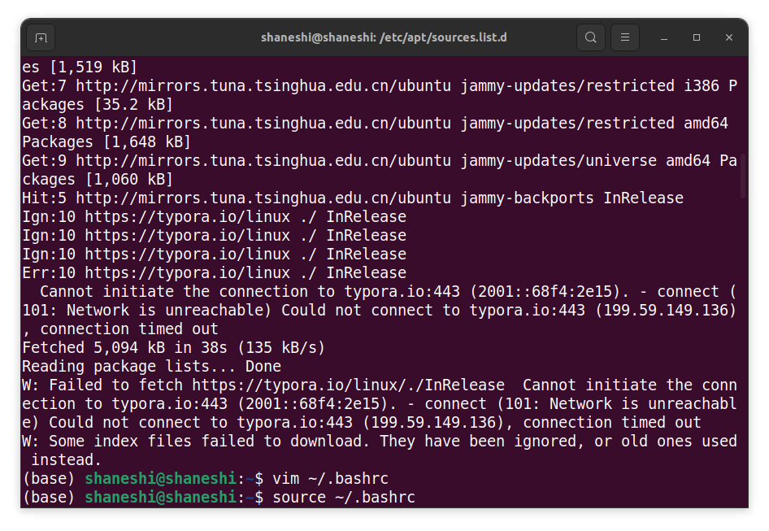

# Linux版本typora更新警告

## 问题描述

使用`sudo apt update && sudo apt upgrade`的时候，出现以下报错。阅读报错信息可知，无法连接typora.io，链接超时。查阅资料，不少博客都表明typora.io源本身就存在一点问题，经常连接不上。如果添加源，使用命令`sudo apt update && sudo apt upgrade`就可以实现升级。但Typora作为文字编辑器，本身也不需要经常更新，所以禁用这个源就好了。



## 禁用第三方源

1. 命令行方式

```shell
# 使用管理员权限，因为修改的文件需要很高的权限
sudo su
# 前往文件夹，sources.list这个文件存放的是官方的源，不要动它
cd /etc/apt
# 前往第三方源
cd ./sources.list.d
# 注释掉typora源
vim archive_uri-https_typora_io_linux-jammy.list
vim archive_uri-https_typora_io_linux-jammy.list.save
```

其实，我也不知道.save这个文件有什么区别，但是里面也保存了typora.io这个源，所以也给它注释了。之后，正常更新，没有报错。

2. 图形化界面

打开 Software&Updates>Other Software，删除typora.io源即可。