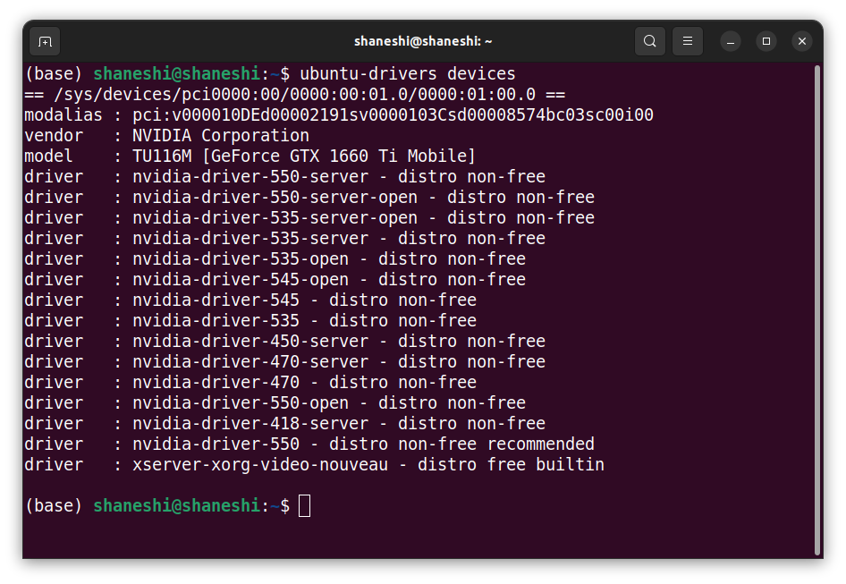
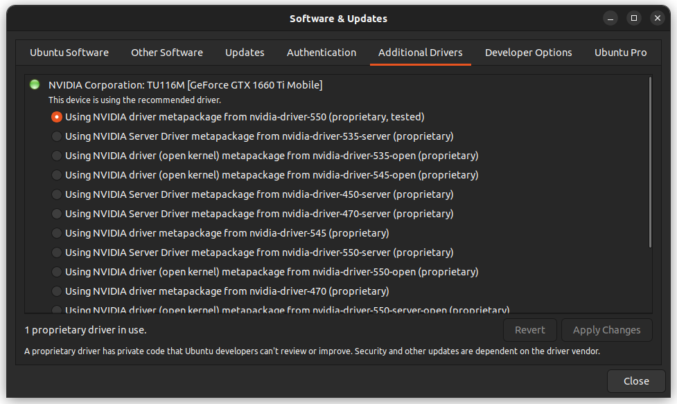
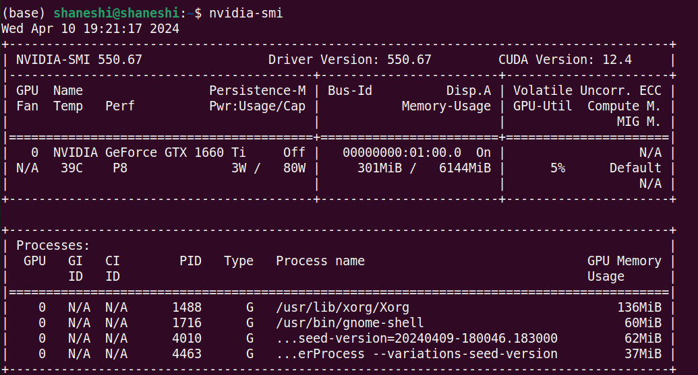
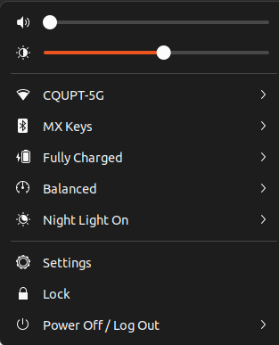

# Ubuntu 22.04 随机自动注销或者杀掉所有进程

## 问题描述

在使用Ubuntu正常工作的时候，会突然自动注销正在使用的用户或者杀掉所有进程。总之，再次亮起屏幕的时候，更重新启动了差不多。如果，当时正在编辑文档，会导致编辑的文档丢失，没有保存。

因此，这个问题必须解决。以下的方法在论坛上，有人安装显卡驱动后，之后的一周都没有出现自动注销的情况。具体是否真的解决这个问题，我暂时不得而知，毕竟实践才是检验真理的唯一标准（目前已经正常使用一天，没有出现自动注销或者杀掉所有进程的问题）。不过，跑深度学习反正也需要使用cuda，也要安装NVIDIA的显卡驱动，所以装了也不亏。

目前已经尝试：扩大swap分区，修改swappiness = 10，均没能解决。

## 解决方式

参考Ubuntu的论坛，发现问题出在显卡驱动，应该使用Nvidia的驱动，而不是开源的xserver-xorg，这是Ubuntu的默认驱动。

### 卸载Nvidia驱动

考虑到安装过程中，可能会有卸载驱动的需求。所以这里讲解一下如何卸载：

```shell
# 删掉与Nvidia有关的任何东西
sudo apt-get --purge remove nvidia*
# 删掉相关依赖
sudo apt autoremove
```


### 安装Nvidia显卡驱动

**网上有很多教程博客在安装之前都禁用了自带的nouveau Nvidia驱动，然而在我的尝试中，不禁用也没有关系。**

1. 查看显卡驱动版本

`ubuntu-drivers devices`



建议选择recommended版本的。

2. 两种安装方式

   - 命令行安装

   ```shell
   # 如果是选择推荐版本，可以直接autoinstall。虽然网上博客上有的说，这会吃网卡，也就是导致之后无法上网，但是我尝试后，发现并没有，可以继续上网。可能运气比较好吧。
   sudo ubuntu-drivers autoinstall
   
   # 如果自行选择版本，xxx表示你选择的版本，比如550
   sudo apt-get install nvidia-drivers-XXX 
   
   # 重启电脑
   reboot
   ```

   - Software&Updates安装

   

选择你想安装的版本，然后点击右下角Apply Changes。

3. **开始安装之后的注意事项**

无论采用哪种方式安装，都会让你输入密码。这里，你可以设置一个自己的密码或者直接使用开机密码也可。然后，重启电脑。

tips：如果是命令行安装，会在终端显示一个界面，界面的下方会有一个OK。需要通过Tab键才能选择这个OK。

**以下步骤非常关键：**

​	这会决定你是否需要重装。如果不按照下面的步骤，会导致驱动安装上了，但是系统没能识别。

​	重启后，会出现一个蓝色的界面。

1. 选择enroll MOK
2. 进入后，选择continue
3. 进入enroll the key界面，选择yes，再输入刚才设置的密码
4. 之后，会跳转到perform mok management界面，选择reboot重启即可。


4. 检查是否安装上

`nvidia-smi`，注意中间没有空格。出现以下界面表示安装成功。




## 可能出现的问题

在安装过程中，如果没有安装好，可能导致屏幕亮度的调节条消失，无法调节屏幕亮度，如图所示。不用着急去解决这个问题，当显卡驱动安装好之后，自然就修复了，这是显卡驱动导致的。



参考：[Ubuntu 22.04 auto log out](https://askubuntu.com/questions/1414900/automatic-logout-using-ubuntu-22-04-lts)