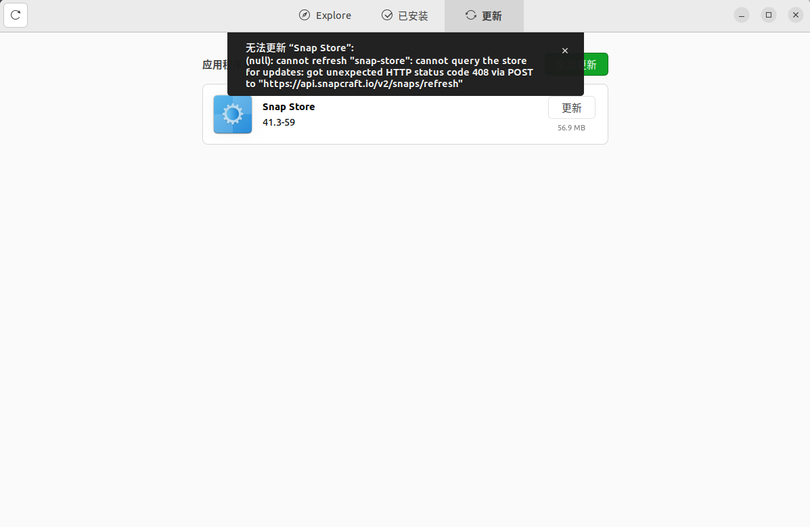

# Ubuntu更新snap store报错

正常在snap store（就像iphone的app store）更新的时候，出现了报错。无论怎么重试，都不行。



**原因：**snap store不能自己更新自己。

**解决方法：**

```shell
# 更新命令，这一步其实是为了获得snap-store的PID，可以通过其他方法获得，如top、ps、pidof等
sudo snap refresh snap-store
# 杀掉进程
kill PID
# 再次更新
sudo snap refresh snap-store
```

