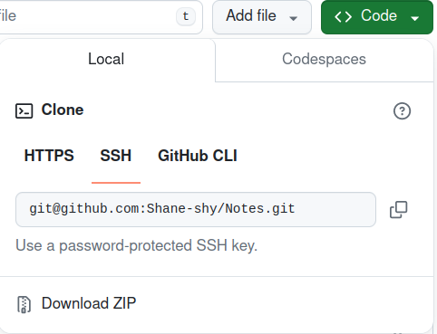

# Git与Github

> Github是一个托管平台网站，包括但不限于托管代码，只支持Git作为唯一的版本控制方式。其实一切需要版本控制的需求，都可以使用GIthub进行托管。GIthub上的每一个仓库内存上限是1G。
>
> Git是一款开源、免费的分布式版本控制系统。

## Git的安装与部署

### 安装

1. Ubuntu安装 `sudo apt-get install git`
2. Mac安装 `brew install git`。homebrew是mac上的软件管理器，具体安装使用方式，见官网。

### 部署

部署的方式应该都是一样的，可能不同操作系统的文件地址不同。因而，这里只展示**Ubuntu**的部署方式

1. 配置用户名和邮箱

```shell
git config --global user.name yourUserName
git config --global user.email yourtEmail
# 查看配置结果
git config --list
```

2. 配置SSH
   1. 生成SSH密钥 `ssh-keygen -t rsa -C "your email address"`，一路回车。注意看返回的信息，其中会包含生成密钥的地址。
   2. 查看密钥。`cat your keygen address`，之后需要复制密钥，粘贴在Github上。
   3. 在Github上配置SSH。settings -> SSH and GPG keys -> New SSH key。Title自己写，Key type选择Authentication key，然后将步骤2的密钥复制在Key内。点击Add SSH key。
   4. 检验配置结果。`ssh -T git@github.com`


## Git使用操作

### 整体流程和常用命令

#### 整体流程

1.  打开终端，切换到需要上传的文件夹。
2. 初始化仓库。这个时候，会出现一个.git的隐藏文件。git的所有操作都保存在这个文件内。如果这个文件删了，那么这个文件夹跟普通文件夹就一样了。
3. 将文件添加到缓存区。
4. 将文件推送到远程仓库（即，Github）。

#### 常用命令

```shell
cd yourPath

git init
# 添加文件到缓存区
git add .
# 提交文件
git commit # 这个会出现一个界面，让你写评论，类似于简介或者提醒
git commit -m  '' # 可以在引号内，直接写评论
# 推送到远程仓库
git push -u origin main(your branch) # 禁止git push -f origin main 强制推送到远程仓库，因为这会之间覆盖远程仓库内的内容。
```

origin：是远程仓库的别名。用于避免与本地仓库重名。

-u：建立本地分支与远程分支的链接。如果远程仓库为空，那么会同时创建分支。如果远程仓库不为空，可以不用加-u。其实如果分不清，全部加-u，也没关系。

### Git命令操作

这里将会介绍一些不太常用的命令。

总结一下：如果要对远程仓库进行增删、重命名等。在本地仓库上修改了，还需要提交并推送到远程仓库里。

1. `git remote add origin yourRepositoryURL`

关联本地仓库与远程仓库。URL选择SSH，而不是HTTPS，目前HTTPS不被官方推荐。**每个仓库只需要关联一次。**



2. `git remote -v`

查看当前本地仓库关联的远程仓库列表。

3. `git remote set-url origin newUrl`

修改关联的远程仓库地址。

4. `git status`

可以查看仓库当前状态。

5. `git log`

查看提交日志。

6. `git checkout branch`

切换分支。`git checkout -b branch`创建新的分支。`git checkout -b branch origin/branch`创建一个与远程分支相同的分支，并且远程分支与这个新建的本地分支关联。（这个还不太确定）

7. `git branch`

查看当前有哪些分支

8. `git branch -m newBranch`

修改分支的名字。之后记得推送到远程仓库内，`git push -u origin newBranch`

9. `git fetch`

从远程仓库中获取最新状态，并且更新在本地仓库上。一个同步的感觉。与`sudo apt update`有点像。它并不会合并，只是更新个状态。

10. `git merge branch`

当前分支与branch分支进行合并。

11. `git branch -D deleteBranch `

删除分支。

12. `git pull origin branch`

拉取origin/branch分支，并且与当前分支合并。相当于`git fetch + git merge branch`

13. `git rm file`  OR `git rm -r file` ，前者是文件，后者是文件夹。**注意：这会把本地文件也一起删了**

删除远程仓库中的文件或者文件夹。之后，需要提交到远程仓库内。即`git commit -m 'deleteFile'`  + `git push origin branch`。还是需要慎重。

14. `git rm --cached fileName`

清除缓存区内的文件。我的理解是**删除远程仓库内的文件，不删除本地文件**。之后，仍然需要`git commit -m 'your comment' + git push origin main`

15. `git clone yourURL`

不需要自己创建文件夹，它会把整个文件夹都克隆下来。在克隆之前，需要切换到你想存放文件的地址上。

## 出现的问题

仅展示目前遇到的问题，之后出现了问题会进行补充。

1. 本地分支是master，而远程分支是main。不能推送到main分支。

解决方法：`git fetch`获取远程仓库状态，更新本地仓库。之后，按照正常流程进行。**如果不行**，尝试创建新的main分支，并切换到main分支，正常推送后，再删除master分支。

```shell
git checkout -b main
git push origin main
git checkout -D master
```

2. 当远程仓库内不为空的时候，需要先拉取仓库，才能推送到分支。

解决方法：`git pull origin main` + 正常推送。之后，工作之前，都先pull一次。

## 编写.gitignore

在使用Git上传到Github的过程中，如果一个一个选择需要上传的文件是很麻烦的一件事，而且每次上传都要一个一个写文件名，那就更加麻烦了。因而，可以在本地编写.gitignore文件，忽略不需要上传的文件，直接`git add .`。

1. 生效顺序

从上到下，依次匹配。如果前面的范围比较大，后面的规则可能都不会生效。**不过，我们平常写的话，用不到什么复杂的匹配规则，可以直接用逗号隔开即可。**

2. 基本语法

```tex
#：注释。跟python一样
/：表示目录。/a/b/，如果从一开始就加了/，则表示从根目录开始。a/b/，这样就表示从当前目录开始。最后再加一个/，表示包含b目录下的所有文件。
*：通配符，匹配多个字符。
？：匹配单个字符
!：表示不忽略某文件或者某目录，相当于取反

其他复杂的匹配，可以参考正则表达式
```

**一行写一个规则**

