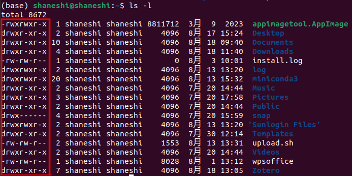

# Linux chmod命令

## 介绍

如下图，使用`ls -l`（-l表示long format，长格式）查看当前目录的完整信息。左侧画框处就表示该文件的权限部分。`chmod`命令就是修改文件或者目录的权限。当使用`.AppImage`软件时，往往需要为其添加可执行权限，否则无法运行。




## 权限概念

### 相关参数

- `-`：位于起始位置，表示文件。位于之后位置，则表示空
- `d`：位于起始位置，表示目录（directory）
- `r`：read，表示可读
- `w`：write，表示可写
- `x`：execute，表示可执行

注意：权限部分后面的数字表示文件或者目录的硬连接数量。关于软硬链接可参考博客[软链接和硬链接对比](https://www.cnblogs.com/coder-shane/p/18204202)

### 用户调用权限

用户调用权限可分为三个级别：文件所有者（Owner）、用户组（Group）、其他用户（Other Users）。分别对应长格式中的三个部分。**只有用户所有者和超级用户（sudo $ \rightarrow $ super user do）才可以修改文件或者目录的权限**。用户组可理解为一个公司有很多员工，每个员工处于不同的部门。这个部门与用户组的概念类似。


## 修改权限

### 符号模式

#### 用户

| who  |  用户类型  |        说明         |
| :--: | :--------: | :-----------------: |
|  u   | user/owner |     文件所有者      |
|  g   |   group    |  文件所有者所在组   |
|  o   |   others   |      其他用户       |
|  a   |    all     | 所有用户，相当于ugo |

#### 操作符

| 操作符 |     说明     |
| :----: | :----------: |
|   +    |   添加权限   |
|   -    |   去除权限   |
|   =    | 重新设置权限 |

### 八进制语法

rwx对应三个bit位，1表示对应位置的权限生效，然后将该二进制转化为八进制（与转换为十进制的方法相同）

| 八进制 |      权限      | 符号 | 二进制 |
| :----: | :------------: | :--: | :----: |
|   7    | 读 + 写 + 执行 | rwx  |  111   |
|   6    |    读 + 写     | rw-  |  110   |
|   5    |   读 + 执行    | r-x  |  101   |
|   4    |      只读      | r--  |  100   |
|   3    |   写 + 执行    | -wx  |  011   |
|   2    |      只写      | -w-  |  010   |
|   1    |     只执行     | --x  |  001   |
|   0    |       无       | ---  |  000   |

## 示例

```shell
# 最常用的，添加可执行权限
chmod u+x file.txt

# 去除可执行权限
chmod u-x file.txt

# 设置权限
chmod u=rwx file.txt

# 如果该电脑只是自己使用的话，可以直接添加所有权限
chmod a=rwx file.txt
chmod 777 file.txt # 与上者相同

# 为当前目录下的所有目录和子目录添加可读权限。-R -> recursive 递归的
chmod -R u+r *
```

## 参考文献

-  [邓瑞编程](https://www.dengruicode.com/classes_content?uuid=58511fe5e9cb43358f24e9cd53c30557)

- [菜鸟教程](https://www.runoob.com/linux/linux-comm-chmod.html)