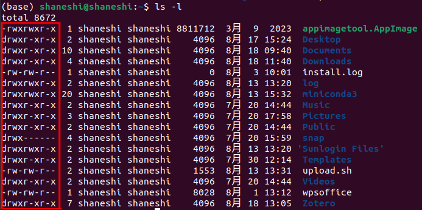

# Linux文件权限管理

## 介绍

如下图，使用`ls -l`（-l表示long format，长格式）查看当前目录的完整信息。左侧画框处就表示该文件的权限部分。当使用`.AppImage`软件时，往往需要为其添加可执行权限，否则无法运行。

如果对文件安全十分在意，可以为文件或目录设置最低权限。

| 权限 | 硬链接数量 | Owner | Group | 文件大小 | 时间 | 文件名 |
| :--: | :--------: | :---: | :---: | :------: | :--: | :----: |



关于软硬链接可参考博客[软链接和硬链接对比](https://www.cnblogs.com/coder-shane/p/18204202)。

## 相关概念

> [!NOTE]
>
> 文件和目录的权限存在差异，请仔细甄别。
>
> **`cp`复制文件或目录会同时复制其权限。**

### 参数

- `-`：
  - 位于起始位置，表示文件
  - 位于之后位置，则表示空

- `d`：表示目录（directory）
- `r`：read
  - 文件：**可读**该文件的实际内容
  - 目录：**可读**该目录下的**文件名**，而不是文件内容

- `w`：write
  - 文件：**可写**。对该文件内容可编辑，但是**不能删除该文件**
  - 目录：**可写**。具有改变该目录结构的权利，即可以对目录内的所有内容进行修改。权限很大，需要小心使用，尤其是在服务器上。
    - 创建新的文件和目录
    - 删除已经存在的文件和目录（**目录权限决定文件是否可以被删除**），即文件被删除的权限不在文件自身
    - 移动该目录内文件和目录的位置（包含了文件和目录的重命名）
    - 等等

- `x`：execute
  - 文件：**可执行**。并不是有可执行权限该文件就可执行。如果该文件自身不支持，比如`.txt`文本，有可执行权限也无济于事
  - 目录：能否**进入**该目录


### 用户

- 文件所有者（Owner）：文件的所有者，通常是文件的创建者或者是被授予权限的人
- 群组（Group）：类似某公司的同一个部门的同事的权限
- 其他用户（Other Users）

**只有用户所有者和超级用户（sudo $ \rightarrow $ super user do）才可以修改文件或者目录的权限**。


## 权限管理

- `chmod`：改变文件权限
- `chown`：改变文件拥有者
- `chgrp`：改变文件所属群组

### 符号模式

#### 操作对象

| who  |  用户类型  |        说明         |
| :--: | :--------: | :-----------------: |
|  u   | user/owner |     文件所有者      |
|  g   |   group    |  文件所有者所在组   |
|  o   |   others   |      其他用户       |
|  a   |    all     | 所有用户，相当于ugo |

#### 操作符

| 操作符 |     说明     |
| :----: | :----------: |
|   +    |   添加权限   |
|   -    |   去除权限   |
|   =    | 重新设置权限 |

### 八进制语法

rwx对应三个bit位，1表示对应位置的权限生效，然后将该二进制转化为八进制（与转换为十进制的方法相同），常用的有777（rwx-rwx-rwx）、755（rwx-r-x-r-x）

| 八进制 |      权限      | 符号 | 二进制 |
| :----: | :------------: | :--: | :----: |
|   7    | 读 + 写 + 执行 | rwx  |  111   |
|   6    |    读 + 写     | rw-  |  110   |
|   5    |   读 + 执行    | r-x  |  101   |
|   4    |      只读      | r--  |  100   |
|   3    |   写 + 执行    | -wx  |  011   |
|   2    |      只写      | -w-  |  010   |
|   1    |     只执行     | --x  |  001   |
|   0    |       无       | ---  |  000   |

## 示例

### `chmod`

`chmod [-R] 权限 fileName/dirName`

```shell
# 最常用的，添加可执行权限
chmod u+x file.txt

# 去除可执行权限
chmod u-x file.txt

# 设置权限
chmod u=rwx file.txt

# 如果该电脑只是自己使用的话，可以直接添加所有权限
chmod a=rwx file.txt
chmod 777 file.txt # 与上者相同

# 为当前目录下的所有目录和子目录添加可读权限。-R -> recursive 递归的
chmod -R u+r *
```

### `chown`

1. `chown [-R] newOwner fileName/dirName`
2. `chown [-R] newOwner:newGroup fileName/dirName`，可以同时修改群组
3. `chown [-R] newOwner.newGroup fileName/dirName`，写法二
4. `chown [-R] .newGroup fileName/dirName`，只修改群组

### `chgrp`

`chgrp [-R] newGroup fileName/dirName`

`-R`：表示可选参数，同上


## 参考文献

-  [邓瑞编程](https://www.dengruicode.com/classes_content?uuid=58511fe5e9cb43358f24e9cd53c30557)

-  [菜鸟教程](https://www.runoob.com/linux/linux-comm-chmod.html)

- 《鸟哥的Linux私房菜：基础学习篇 第四版》
