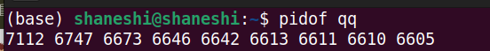
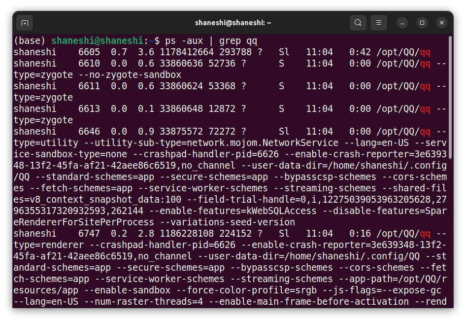
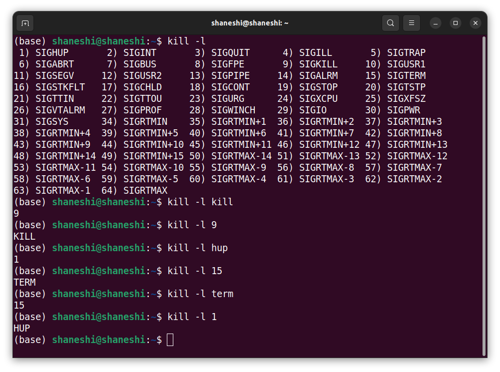

# Ubuntu杀死进程kill

**整体流程**

1. 找到进程的PID
2. kill PID

## 查找进程

查找的方式有很多，如top、htop、ps、pidof、system monitor等。

system monitor类似于Linux版的任务管理器，可以直接通过右键杀死进程。如果没有安装，可以通过`sudo apt-get install gnome-system-monitor`。

也可以通过top和htop的方法，按下k（具体按键，看操作界面提示），输入PID，回车。

今天介绍通过ps和pidof。

### pidof

用于查到进程的PID。使用方式很简单，但是需要知道进程的名字，如果是软件的话，就是软件名。

```shell
pidof your_process_name
```



一个软件可能有很多个进程，如果只杀掉其中一个的话，可能这个软件不会被杀掉。之后，会讲解如何全部杀掉。

### ps

ps（process status）用于显示当前进程的状态，类似于Windows的任务管理器。它的参数非常多，这里仅介绍针对杀进程用得上的参数。**参数区分大小写**

```shell
# 列出所有进程
ps -A
# 显示所有包含其他使用者的进程 -> 这台电脑正在运行的所有进程
ps -aux # ps aux 也可以
```

输出中，只需要关注PID。

`USER PID %CPU %MEM VSZ RSS TTY STAT START TIME COMMAND`

- USER：用户

- PID：进程号

- CPU：占用CPU的使用率

- MEM：物理内存的使用率，即运行内存，断电要丢失信息

- VSZ、RSS、TTY，我预感我用不上，有需求的小伙伴可以自行查阅

- STAT：运行状态。有很多状态，有需求的小伙伴可以自行查阅
- START：进程开始时间
- TIME：执行时间
- COMMAND：执行的命令


**常用方式：**`ps -aux | grep xxx`



有的输出很长，不要担心，只需要关注PID即可，即6605，6610，6611，6646，6747等。

## 杀掉进程

**注意：**kill命令只是发送指定的信号到程序。

### 常用命令

1. `kill -l`：查看信号。可以加入信号名，查看该信号对应的数字。



2. 常用信号

**默认信号是TERM。**

```shell
# 正常杀死进程
kill PID
kill -15 PID
kill -TERM PID
# 强制杀死进程
kill -9 PID
kill -KILL PID # KILL信号相当于9数字
# 重新加载进程，即重新运行
kill -1 PID
kill -HUP PID
```

忘记了，都可以通过`kill -l`查看。

3. 其他进程终止方法

只有`kill`需要PID，其他都是进程名。之前使用的信号（如TERM、KILL、HUP）在下面的命令里都能使用。默认是使用TERM信号。

- killall。通过名字，杀掉该名字下的所有进程。实用于一个软件但是开启了多个进程的时候。

`killall -signal process_name`

- pkill。通过名字，杀掉该名字下的所有进程。**与killall不同，它的名字可以是完整的名字，也可以是部分名字。** 

`pkill -signal porcess_full_name (or process_part_name)`

总结：`pkill`最方便，因为可以一次性通过部分进程名杀掉所有进程，所以如果熟悉进程的话，都可以不用去查找进程。
