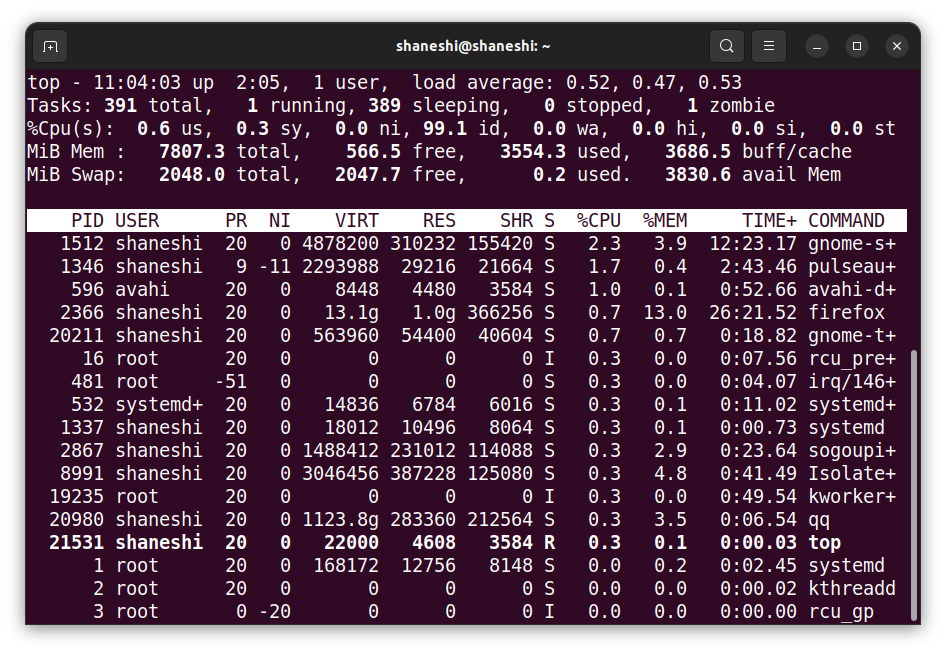
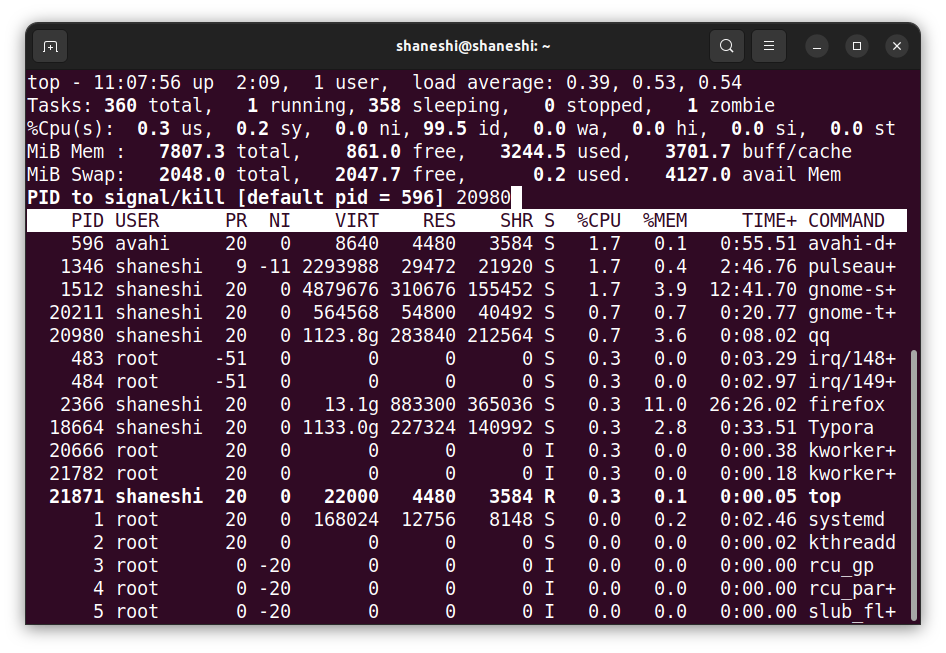

# Ubuntu杀死进程kill

目前仅展示使用过的命令，之后如何有其他需求，将会对其进行补充。

**整体流程**

1. 找到进程的PID
2. kill PID

杀掉进程的方式有很多，比如ps、top、htop、pidof。我这里使用了最简单的top。

1. 输入`top`

在COMMAND里可以看到正在运行的进程名。

2. 找到需要的进程名，按下K。输入进程号，按下回车确认。

以kill腾讯QQ为例。

