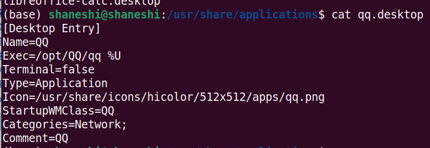
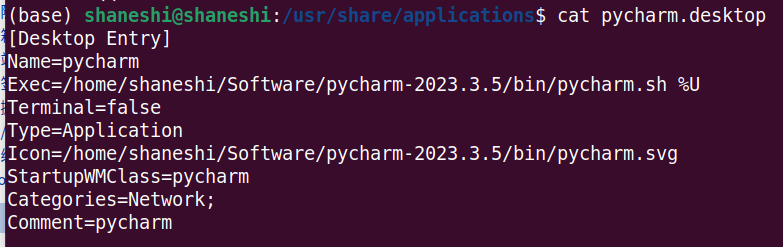

# Ubuntu配置软件快捷方式

本次以Ubuntu安装pycharm为例。

需要在`/usr/share/applications`进行配置。

1. 进入上述地址
2. 将pycharm的配置写入.desktop文件

```shell
# 进入目录
cd /usr/share/applications 
# 查看其他软件的配置文件是怎么写的
cat xxx.desktop
# 模仿写pycharm的配置文件
vim pycharm.desktop

# 过滤信息，grep进行过滤。在前面添加|，后面可以使用正则表达式，也可以写可能出现的字符
ls | grep pycharm
```

**以下以QQ为例，展示需要更改的地方：**



name：软件名字

Exec：软件执行的路径。这个因软件而异。比如Pycharm只需要 bash pycharm.sh

Icon：图标位置。一般下载软件后，软件的文件夹内都会有。

StartupWMClass：不懂，但跟着改。

comment：不懂，但跟着改。

**结果展示：**这样之后，桌面就会出现图标，并且能够正常使用。

