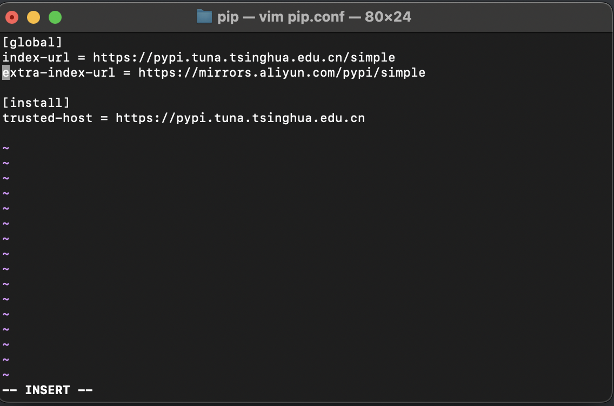

# pip换源


## 国内源

1. 清华源：https://pypi.tuna.tsinghua.edu.cn/simple
2. 阿里源：https://mirrors.aliyun.com/pypi/simple/
3. 腾讯源：http://mirrors.cloud.tencent.com/pypi/simple
4. 豆瓣源：http://pypi.douban.com/simple/
5. 中科大：https://mirrors.bfsu.edu.cn/pypi/web/simple/
		我个人推荐清华源，日常使用没有问题。

## 操作流程
1. Linux操作流程
```shell
cd ~/.pip
vim pip.conf
```
2 . 图片展示


直接进行修改进行了。extra-index-url是指额外的源，当前源匹配不上的时候，匹配额外的源。

trusted-host就是网址除子页面的部分，如https://pypi.tuna.tsinghua.edu.cn。

参考文档：

[菜鸟教程](https://www.runoob.com/w3cnote/pip-cn-mirror.html)
	[清华源](https://mirrors.tuna.tsinghua.edu.cn/help/pypi/)