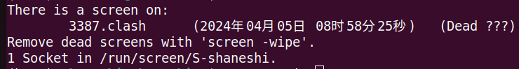

# screen 终端后台运行命令

在使用clash的时候，需要使用命令行让clash在前台运行，十分不方便。screen可以让命令在后台运行。

## screen安装

`sudo apt install screen`

## 常用命令

```shell
# 查看有多少screen在运行
screen -ls
# 创建screen
screen -R screenName # 如果有重名会话，则恢复该会话
screen -S screenName # 创建会话，可能会有重名
# 回复会话
screen -r screenName
# 退出会话
exit

#进入会话后，让会话后台运行
ctl + A + D
```

之后，有需求使用其他命令，将会进行补充。

## 异常情况

如何某个进程自己挂掉了。



使用`screen -wipe`进行清除。