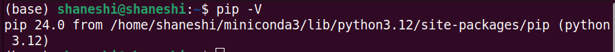
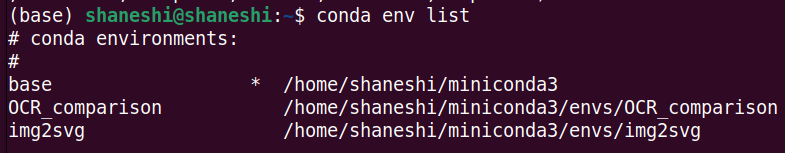
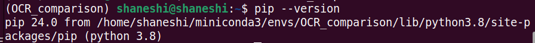

# `pip`虚拟环境安装包

## 问题描述

通常情况下，我们常使用`Conda`创建虚拟环境，然后再在虚拟环境内进行安装相应的软件包。虚拟环境可以让我们免收软件包的版本冲突的问题。但是有一些软件包不能通过`Conda`安装，只能通过`pip`安装。通常情况下，`pip`安装的软件包作用于全局，因而又会导致软件包的版本冲突问题。

## 解决方法

在虚拟环境内，使用`pip`。

1. 创建虚拟环境。`conda create --name env your_env_name`
2. `Conda install pip`。如果该虚拟环境没有自带`pip`，则安装它
3. 使用`pip`安装软件包，是安装在**虚拟环境**内的。相当于使用的是虚拟环境内的`pip`

## 验证猜想

在终端内查看`pip`的版本号，会同时显示`pip`的安装位置。

- base环境

- OCR_comparison环境

结果验证了猜想，通过虚拟环境内的`pip`安装的软件包是保存在虚拟环境内的。当虚拟环境被删除时，`pip`安装的软件包也会一并被删除。