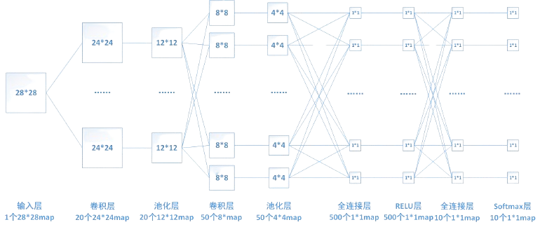

# 全连接层详解

该博客仅是笔者对于全连接层的浅薄理解。如果存在问题，请务必告知我，谢谢。

## 前言

全连接层是常见的神经网络层，可以作为模型的分类器（可理解为将特征维度映射到类别维度上），也可以作为特征提取。不过，对于初学者，可以直接认为全连接层是模型的分类器。毕竟大多数情况下，全连接层都是扮演的分类器的角色。

全连接层中的每一个结点都会与前一层的全部结点相连，因此全连接层的可学习参数非常多，可能会占该模型参数量的80%（数据为经验值，不准确），会消耗大量的计算资源，所以如果希望模型训练得更快，可考虑精简全连接层，比如使用*卷积代替全连接层*。常见的全连接层的结构如下图，但笔者认为该图仅能清晰地展示全连接层的每一个结点都与前一层结点，不过不能揭示全连接层的本质——矩阵Matrix。

## 全连接层计算

**计算公式：**$y = x \cdot w + b$，其中$w$和$b$是可学习参数。**模型训练其实就是更新模型中的可学习参数。**

从公式里可以看出，全连接层其实跟MLP（多层感知机）、卷积层类似，都是在做多项式求和。**注意：整个神经网络本质上其实都是在做多项式求和。**

在Pytorch中，全连接层的使用是`nn.Linear(input_features, output_features)`，即输入维度和输出维度，全连接层的作用可理解为维度映射。

### 示例

假设$input_features = 3$，$output_features = 2$相当于一个二分类问题。输入特征$x$的形状为$5 \times 3$，则权重矩阵$w$的形状为$3 \times 2$，偏置$b$的形状为$5 \times 1$。输入特征可以理解为5个样本，每个样本有3个特征；权重矩阵可理解为将输入特征的三维映射到二维。
$$
\begin{align}
\begin{pmatrix} 
y_1 \\ y_2 \\ y_3 \\ y_4 \\ y_5
\end{pmatrix} 
 &
= 
\begin{pmatrix} 
x_{1,1} & x_{1,2} & x_{1,3}  \\ 
x_{2,1} & x_{2,2} & x_{2,3}  \\
x_{3,1} & x_{3,2} & x_{3,3}  \\
x_{4,1} & x_{4,2} & x_{4,3}  \\ 
x_{5,1} & x_{5,2} & x_{5,3} 
\end{pmatrix}

\cdot

\begin{pmatrix}
w_{1,1} & w_{1,2} \\
w_{2,1} & w_{2,2} \\
w_{3,1} & w_{3,2}
\end{pmatrix}

+
\begin{pmatrix}
b_1 \\
b_2 \\
b_3 \\
b_4 \\
b_5
\end{pmatrix}
\\ &
= 
\begin{pmatrix} 
x_{1,1} \cdot w_{1,1} + x_{1,2} \cdot w_{2,1} + x_{1,3} \cdot w_{3,1} + b_1 & x_{1,1} \cdot w_{1,2} + x_{1,2} \cdot w_{2,2} + x_{1,3} \cdot w_{3,2} + b_1 \\ 
x_{2,1} \cdot w_{1,1} + x_{2,2} \cdot w_{2,1} + x_{2,3} \cdot w_{3,1} + b_2 & x_{2,1} \cdot w_{1,2} + x_{2,2} \cdot w_{2,2} + x_{2,3} \cdot w_{3,2} + b_2 \\ 
x_{3,1} \cdot w_{1,1} + x_{3,2} \cdot w_{2,1} + x_{3,3} \cdot w_{3,1} + b_3 & x_{3,1} \cdot w_{1,2} + x_{3,2} \cdot w_{2,2} + x_{3,3} \cdot w_{3,2} + b_3 \\ 
x_{4,1} \cdot w_{1,1} + x_{4,2} \cdot w_{2,1} + x_{4,3} \cdot w_{3,1} + b_4 & x_{4,1} \cdot w_{1,2} + x_{4,2} \cdot w_{2,2} + x_{4,3} \cdot w_{3,2} + b_4\\ 
x_{5,1} \cdot w_{1,1} + x_{5,2} \cdot w_{2,1} + x_{5,3} \cdot w_{3,1} + b_5 & x_{5,1} \cdot w_{1,2} + x_{5,2} \cdot w_{2,2} + x_{5,3} \cdot w_{3,2} + b_5 \\ 
\end{pmatrix}
\end{align}
$$
在模型输出的时候，选择概率大的一个作为最终输出。由上述例子可以看出，$y_i$中对应的每一个$x_{i,j}$都参与到了最终结果计算中，每一个$x_{i,j}$都会对结果产生影响，体现了全连接的“全”，即全连接结构图中的每一个结点都与前一层的每一个结点相连。

换个角度理解，提取特征——> 对特征进行多项式求和，给特征确定权重，以表示该特征在此任务中的重要性。**那是否可以将全连接层也看作是特征提取呢？$w_{i,j}$就是输入数据$x_{i,j}$的权重。笔者认为可以，在有的论文中也确实是这样做的。**