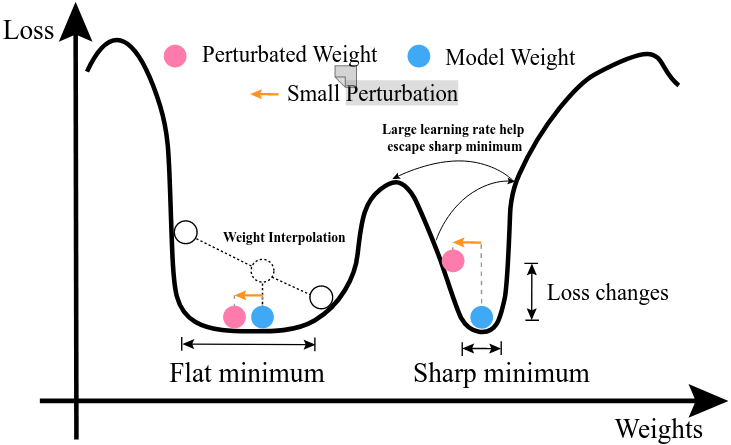

# 利用交叉熵评估损失平坦度

## 背景介绍

在进行模型训练的时候，我们通常假设训练集和测试集是独立同分布的。可事实上，两个数据集往往难以做到完全同分布，这也是有时候训练集效果很好，但是测试集效果稍差的原因之一（当然，最可能的是过拟合了）。在同一个域（可以简单把“域”理解为同一个数据集）的数据集都存在这个问题，在不同域的数据集更是如此。在实际生产中，我们不可能要为每一个数据集都训练一个独有的模型，因此我们需要模型自身具有较好的泛化性，即同一个模型在不同分布的数据集上也能有较好的效果。

为了实现模型的泛化性，目前通常的做法是在loss landscape（如下图所示）中寻找flat minimum（最小平坦度）。不同的论文对平坦度的定义不尽相同。

loss landscape描述的是不同权重配置下的loss变化情况。为什么Flat minimum处的泛化性较好？

- Loss越小，模型性能通常较好，所以需要找小的loss值。
- 我们可以简单认为一套权重参数对应一个数据集。那么当模型在不同配置下的权重下，loss都比较小，即图中的Flat minimum，则该模型的泛化能力较强。因此，如何找到Flat minimum就是提高模型泛化性的关键。

## 理解交叉熵与平坦度之间的关系

这里，我们不探究具体如何找到最小平坦度的方法，而是主要探究其中的一个小方向——交叉熵与平坦度的关系。交叉熵（公式如下）本身是一个常见的损失函数，尤其是在分类任务中。它常用来描述**两个分布之间的差异**——真实分布与模型预测分布。最大化交叉熵 $\rightarrow$最小化$\mathcal{L}(\theta^{'})$和$||\theta - \theta^{'} ||^{2}$ $\rightarrow$找到最小平坦度。
$$
F(\theta,\gamma) = log\int_{\theta^{'}}exp(-\mathcal{L(\theta^{'}) - \frac{\gamma}{2}||\theta - \theta^{'} ||^{2}})d\theta^{'}
$$

- log：对数。用于缩放结果，防止结果过大，增加计算负担。
- exp：指数函数$e^x$，单调递增。
- $\gamma$：超参，用于控制附近权重的范围。
- 积分的作用：从积分的数学含义出发，积分相当于加权求和。

在权重更新的过程中，$\mathcal{L(\theta^{'}) + \frac{\gamma}{2}||\theta - \theta^{'} ||^{2}}$这部分会越来越小。损失函数变小，意味着模型的性能变好；权重间的距离变小，意味着模型更倾向去找与当前权重附近的权重（距离近的权重），这样的好处是能够避免权重的微小变化，给$F$函数带来剧变，即避免Sharp minimum。由于使用了指数函数，其单调递增的特性，变相地增加了与当前权重距离近的权重的重要性，弱化距离较远的权重重要性。这是由于指数函数$e^x$不是线性递增，自然当$||\theta - \theta^{'} ||^{2}$越小，则$exp(-\mathcal{L(\theta^{'}) - \frac{\gamma}{2}||\theta - \theta^{'} ||^{2}})$更大。相当于增加了附近权重的重要性。

最后会得到什么样的结果？**与当前权重邻近的权重对应的Loss变化不大，即找到了平坦最小值。**