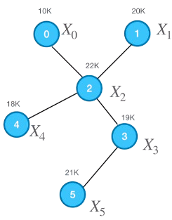

# 图神经网络——GCN聚合原理理解

> 本博客基于B站UP主[望舒同学](https://space.bilibili.com/29834628/channel/collectiondetail?sid=939702)的[图神经网络系列讲解及代码实现-GCN1](https://www.bilibili.com/video/BV1z14y1A7JX/?spm_id_from=333.999.0.0&vd_source=f5fa465fb229f9bbfa11556291b96b03)。

GCN的核心思想：通过邻接矩阵A对结点特征进行**聚合**，用于更新某结点特征。不同的聚合方式$\rightarrow$ GCN变体。

GCN基于的一个假设：结点的特征与其邻居结点有密切的关系，并且距离越近的邻居关系越大。

## GCN聚合直接邻居结点

这是一个简单的图结构。笔者将以该图为示例，讲解GCN以最简单的方式（求平均）聚合直接邻居结点流程。由上图结构可知，其邻接矩阵为$A = \begin{pmatrix} 0 & 0 & 1 & 0 & 0 & 0 \\ 0 & 0 & 1 & 0 & 0 & 0 \\ 1 & 1 & 0 & 1 & 1 & 0 \\ 0 & 0 & 1 & 0 & 0 & 1 \\ 0 & 0 & 1 & 0 & 0 & 0 \\ 0 & 0 & 0 & 1 & 0 & 0 \\ \end{pmatrix}$，结点特征$X = \begin{pmatrix} X_0 \\ X_1 \\ X_2 \\ X_3 \\ X_4 \\ X_5 \end{pmatrix} =  \begin{pmatrix} 10 \\ 20 \\ 22 \\ 19 \\ 18 \\ 21 \end{pmatrix} $，度矩阵$D = \begin{pmatrix} 1 & 0 & 0 & 0 & 0 & 0 \\ 0 & 1 & 0 & 0 & 0 & 0 \\ 0 & 0 & 4 & 0 & 0 & 0 \\ 0 & 0 & 0 & 2 & 0 & 0 \\ 0 & 0 & 0 & 0 & 1 & 0 \\ 0 & 0 & 0 & 0 & 0 & 1 \\ \end{pmatrix}$。

### Step 1——求和

以$X_2$为更新对象。**注意**：$A_i$表示邻接矩阵的第$i$行，$A_{ij}$表示邻接矩阵的第$i$行第$j$列。
$$
\begin{align}

aggregate(X_2) & = X_0 + X_1 + X_3 + X_4 	 \nonumber \\
			   & = 1 \cdot X_0 + 1 \cdot X_1 + 0 \cdot X_2 + 1 \cdot X_3 + 1 \cdot X_4 + 0 \cdot X_5 \nonumber \\
               & = A_2 X

\end{align}
$$
虽然这样更新了$X_2$，但是没有包含其本身的特征。总不能全部依靠邻居的特征吧，显得不太合理。因此，加上自身的特征，相当于自环。$\hat{A} = A + I = \begin{pmatrix} 1 & 0 & 1 & 0 & 0 & 0 \\ 0 & 1 & 1 & 0 & 0 & 0 \\ 1 & 1 & 1 & 1 & 1 & 0 \\ 0 & 0 & 1 & 1 & 0 & 1 \\ 0 & 0 & 1 & 0 & 1 & 0 \\ 0 & 0 & 0 & 1 & 0 & 1 \\ \end{pmatrix}$，$I$为单位矩阵。

则（1）式修改为
$$
\begin{align}

aggregate(X_2) & = X_0 + X_1 + X_2 + X_3 + X_4 	 \nonumber \\
			   & = 1 \cdot X_0 + 1 \cdot X_1 + 1 \cdot X_2 + 1 \cdot X_3 + 1 \cdot X_4 + 0 \cdot X_5 \nonumber \\
               & = \hat{A_2} X

\end{align}
$$

### Step 2——求平均

因为$\hat{A}$考虑到了自身特征，所以$\hat{D} = D + I$。
$$
\begin{align}

aggregate(X_2) & = \frac{X_0 + X_1 + X_2 + X_3 + X_4}{5}	 \nonumber \\
			   & = \frac{1 \cdot X_0 + 1 \cdot X_1 + 1 \cdot X_2 + 1 \cdot X_3 + 1 \cdot X_4 + 0 \cdot X_5 }{5} \nonumber \\
               & = \frac{\hat{A_2} X}{5} \nonumber \\
               & = \frac{\hat{A_2} X}{\hat{D}_{2,2}} \nonumber \\
               & = \hat{D}_{2,2}^{-1}\hat{A_2} X              
\end{align}
$$
整体计算如下：
$$
\begin{equation}
aggregate(X) = \hat{D}^{-1} \hat{A} X
\end{equation}
$$
**注意**：$\hat{D}$是对角阵，因此左乘和右乘结果相同，并且其逆等于对角线元素值的倒数。

（4）式其实相当于使用了一种归一化方法，即非对称归一化邻接矩阵，目的是消除结点度数对聚合信息的影响。详见[图神经网络知识总结——归一化](https://www.cnblogs.com/coder-shane/p/18386628)。也可以采用其他方式求平均方式或称为归一化方式，如对称归一化邻接矩阵、归一化拉普拉斯矩阵等。

### Step 3——更新

将求平均后的值作为聚合后的特征值。

## GCN聚合间接邻居结点

**实际操作**：在第一次卷积的基础上，以相同的方式，进行第二次卷积，第三次卷积 ……

**理解**：第一次卷积之后，结点特征已经聚合了其直接邻居结点的特征，所以再一次进行卷积的时候，虽然看上去还是在对直接邻居结点进行卷积，但是相当于在对其邻居的邻居结点（间接邻居结点）进行卷积。