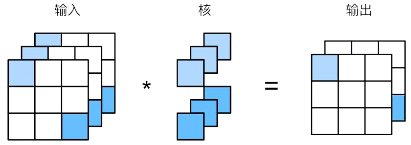

# 多通道卷积和卷积参数的理解

> 卷积的具体执行流程不属于本博客的重心。

## 问题描述

卷积的大致执行流程是卷积核对输入张量进行多项式求和运算。如果输入的张量有多个通道，如RGB三通道，那么卷积又是怎么执行的呢？1X1卷积（记作一维卷积）不能获取到局部特征，那么其存在的意义是什么呢？一维卷积的可学习参数是否就是1个呢？

问题总结：

1. **多通道**张量的卷积流程
2. 一维卷积的作用
3. 卷积的**可学习参数**。权重 = 可学习参数

## 多通道卷积

### 流程

如图所示，假设输入的维度为(channels, height, weight)  $\rightarrow$ (3,3,3)，卷积核的大小为(1, 1)。

如果输入的维度只有1个通道，那么卷积核可以按照一般情况通过多项式求和的方式进行卷积。

但是如果输入是多维呢？**同一个卷积核，对多个通道进行卷积，得到多个特征图，然后将各个特征图的各元素对应位置相加。**从而得到一个输出特征图。正如图所示，中间的两个卷积核，“分裂”成三个（三个是对应输入数据的通道数）。**一个卷积核   $\rightarrow$  一个输出特征图**。 

综上所示，可以简单理解为：

- 卷积核的批次大小（用批次batch形容其实不太准确）与输入的通道数相同
- 由多个通道卷积得到的多个特征图通过相加“聚合”为一个输出特征图
- 一个卷积核对应一个输出特征图

这也是为什么pytorch中使用卷积需要指明卷积的输入通道数和输出通道数。`torch.nn.Conv2d(in_channels, out_channels, kernel_size)`

### 启发

> 卷积可以改变输入数据的高、宽、通道数。

既然如此，卷积可以实现以下作用：

1. 提升/降低通道数。提升通道数有利于提取到更深层次的特征。
2. 一维卷积不能改变输入数据的高和宽，但是能改变通道数。因此，可以用一维卷积来模拟线性层（全连接层）。因为卷积的参数远小于线性层，所以可以一定程度上提高模型训练/推理速度。

## 卷积参数

首先，卷积中可学习的参数主要是卷积核内的参数。最开始卷积核内的参数是随机初始化的，通过梯度下降算法，不断对参数进行更新。但是**卷积中可学习参数数量 $\not=$ 卷积核中元素个数（$height \times width$**）

由多通道卷积流程可知，如果输入数据是多通道，那么在卷积的过程中，每个卷积核会“分裂”成通道数个，然后对每一个通道都进行卷积。所以，**一个卷积核**的参数量为$height \times width \times C_{in} $。输出通道数量决定卷积核个数，所以**卷积层**的参数量为$height \times width \times C_{in} \times C_{out}$。

事实上，每一个卷积核会给其输出特征图添加一个偏置（标量，可被更新）。

因此，最终卷积层参数量为：
$$
height \times width \times C_{in} \times C_{out} + C_{out}
$$
