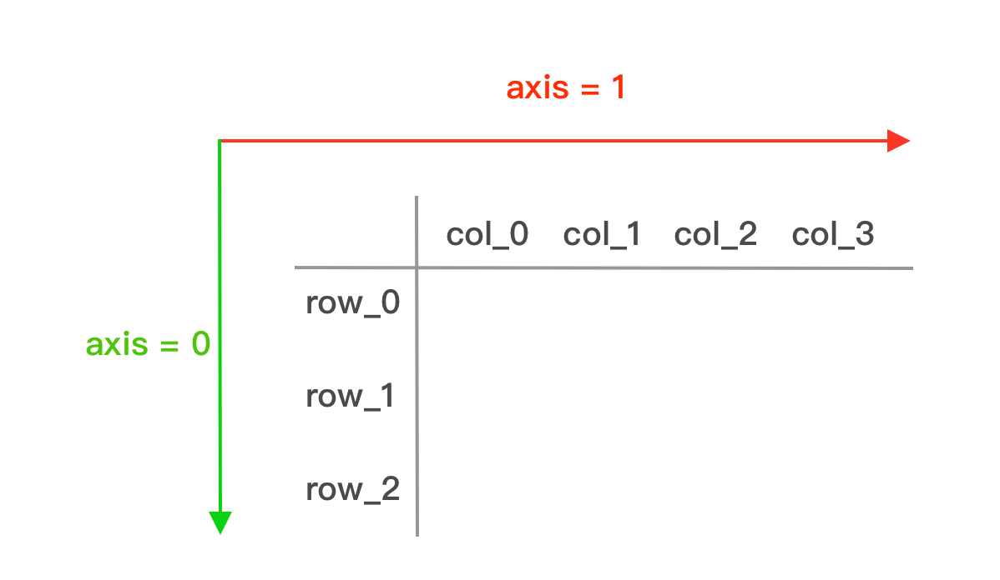

# axis参数讲解

> axis在python使用中非常常见，比如numpy、pandas等使用情景。但是笔者几乎每次都会忘记`axis = 0`和`axis = 1`各自对应的是行还是列，最终决定写下笔记以防再次忘记。

## 讲解

axis的作用：指明以行为单位进行处理数据，还是以列为单位处理数据。下图就已经很清晰地展示了`axis = 0`和`axis = 1`，一图胜千言。

- `axis = 0`：沿行方向，对**每一列**进行处理
- `axis = 1`：沿列方向，对**每一行**进行处理



## 举例

`axis`的使用逻辑在python中是相通的。

### pandas

```python
import pandas as pd

# 'A'、'B'、'C'是列名
#	A	B	C
#0	1	2	3
#1	4	5	6
df = pd.DataFrame({
    'A': [1, 4],
    'B': [2, 5],
    'C': [3, 6]
})

# axis=0, 对列求和
print(df.sum(axis=0))  # 输出: A 5, B 7, C 9

# axis=1, 对行求和
print(df.sum(axis=1))  # 输出: 0 6, 1 15
```

### numpy

```python
import numpy as np

arr = np.array([[1, 2, 3],
                [4, 5, 6]])

# axis=0, 对列求和
print(arr.sum(axis=0))  # 输出: [5, 7, 9]

# axis=1, 对行求和
print(arr.sum(axis=1))  # 输出: [ 6, 15]
```

