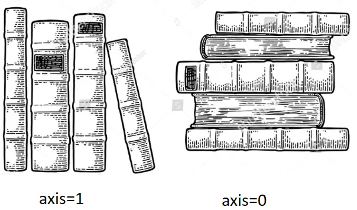

# axis参数讲解

> axis在python使用中非常常见，比如numpy、pandas等使用情景。但是笔者几乎每次都会忘记`axis = 0`和`axis = 1`各自对应的是行还是列，最终决定写下笔记以防再次忘记。

axis的作用：指明以行为单位进行处理数据，还是以列为单位处理数据。下图就已经很清晰地展示了`axis = 0`和`axis = 1`，一图胜千言。

以下是笔者自己想的记忆方法：

​	变量matrix的形状是[row,column]。`axis = 0` $ \rightarrow $ 列表中的第一个row $\rightarrow$ 按行处理；`axis = 1` $ \rightarrow $ 列表中的第二个column $\rightarrow$ 按列处理。